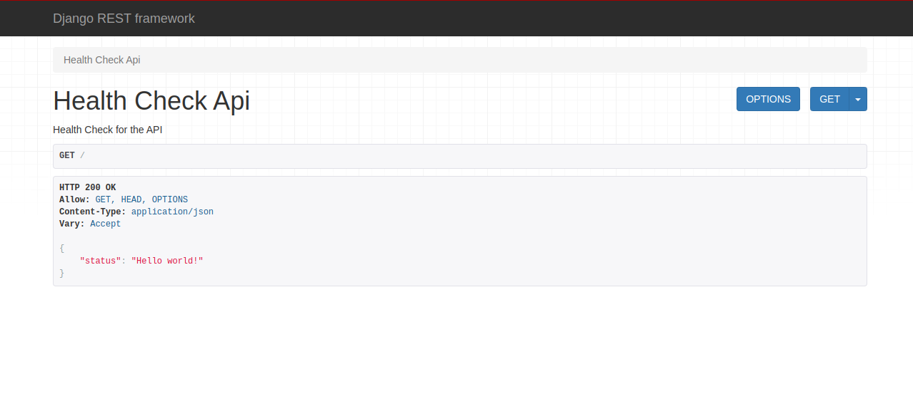
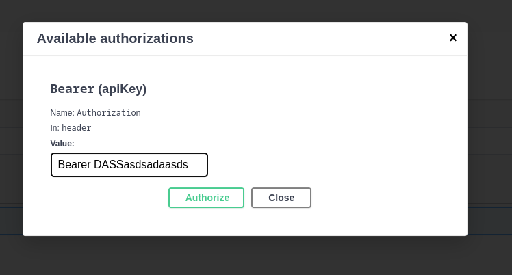

# zebrands_backend_test
___
Basic catalog system to manage products.

- Developed with the Django framework
- The admin users can:
    - create, list, delete and update other users
    - create, list, delete and update brands and products
- The anonymous users only can list and retrieve product information
- When a anonymous user retrieve information about a product an track history is created
- When an admin user changes a product property(sku, name, price) an email is send to other admin users with the product information that was updated.
- The authentication system for APIs is JWT and it is necessary to include it in the headers with the prefix ```Bearer```


## Run project
1. Copy the `.env.example` to `.env`
```
cp .env.example .env
```
Update variable values
~~~
SES_AWS_ACCESS_KEY=1231313 #Your AWS Access Key
SES_AWS_SECRET_KEY=123123 #Your AWS Secrete Key
SES_AWS_REGION=us-east-1
SES_AWS_SOURCE=email@example.com #Your email verified in AWS SES
~~~
**Note: Do not forget to move your user from the SES sandbox to test with several emails as recipients without the need to verify them**

2. You can use `Make` to build the image and create the first super user:
```
make build # Build the image
make start # Start the containers
make createsuperuser # Create a super user
make bash # launch the cointaner bash
make bash # launch the django shell
```
3. Access to `http://localhost:8000/` to view the health check:


If you create a super user you can access the admin:
`http://localhost:8000/admin`

## Documentation
The swagger docs is available on:

`http://localhost:8000/docs`

List and retrieve product they are the only endpoints that do not request authentication.

For the others you will need a JWT, use `/users/api/v1/token/refresh/` for request an access token and use it with the Bearer prefix:



## Postman collections
You can use the Postman collection for test:

[](https://app.getpostman.com/run-collection/587528-3f090b4a-8f62-4e2b-b9cf-1d3d5bb68b11?action=collection%2Ffork&collection-url=entityId%3D587528-3f090b4a-8f62-4e2b-b9cf-1d3d5bb68b11%26entityType%3Dcollection%26workspaceId%3D87227067-2bba-4862-97e3-a425444e8ff4#?env%5BProductos%20Local%5D=W3sia2V5IjoidXJsIiwidmFsdWUiOiJodHRwOi8vbG9jYWxob3N0OjgwMDAiLCJlbmFibGVkIjp0cnVlLCJ0eXBlIjoiZGVmYXVsdCIsInNlc3Npb25WYWx1ZSI6Imh0dHA6Ly9sb2NhbGhvc3Q6ODAwMCIsInNlc3Npb25JbmRleCI6MH0seyJrZXkiOiJ0b2tlbiIsInZhbHVlIjoiIiwiZW5hYmxlZCI6dHJ1ZSwidHlwZSI6ImRlZmF1bHQiLCJzZXNzaW9uVmFsdWUiOiJudWxsIiwic2Vzc2lvbkluZGV4IjoxfSx7ImtleSI6InJlZnJlc2hfdG9rZW4iLCJ2YWx1ZSI6IiIsImVuYWJsZWQiOnRydWUsInR5cGUiOiJkZWZhdWx0Iiwic2Vzc2lvblZhbHVlIjoibnVsbCIsInNlc3Npb25JbmRleCI6Mn1d)